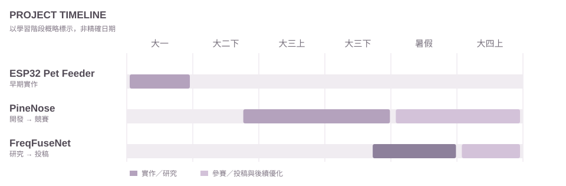

<strong>繁體中文</strong> &nbsp; · &nbsp; <a href="https://github.com/lin-jessic/lin-jessic/blob/main/en/README.md">English</a> &nbsp; · &nbsp; <a href="https://github.com/lin-jessic/lin-jessic/blob/main/ja/README.md">日本語</a>

COMPUTER SYSTEMS · BIOMEDICAL IMAGING · RESEARCH

## 關於我

我是**林冠妤（Guan-Yu Lin）**，來自**台灣**，目前就讀**長庚大學資訊工程學系（台灣）**。過去接觸過生物與化學工程領域，轉入資訊工程後，逐漸把興趣延伸到**軟硬體整合、嵌入式系統、人工智慧與生物醫學影像分析**。

我喜歡從實際問題出發，透過實作、測試與研究，理解一套方法如何在真實系統中運作。

## 學習歷程

- **高中：丹鳳高級中學（台灣）** — 第四類組（生物）
- **大一：大同大學（台灣）** — 化學工程與生物科技學系
- **大二至今：長庚大學（台灣）** — 資訊工程學系；主要關注軟硬體系統與生物醫學影像

這個 [ESP32 寵物自動餵食機](https://github.com/lin-jessic/esp32-pet-feeder-archive) 是我在大同大學時做的早期作品。當時從感測器、程式判斷到實際控制馬達，第一次比較完整地接觸軟硬體整合，也讓我發現自己更想往資訊工程發展，後來才決定轉學。最近找回當年的原始檔案，所以也把它整理上傳，保留當時的實作紀錄。

### 專案時程

ESP32 寵物餵食機為大一時期作品；PineNose 自大二末開始規劃、大三主要開發，之後持續參賽與優化；FreqFuseNet 於大三末至暑假進行研究，大四進入論文投稿階段。

---

## 01. PineNose

**鳳梨電子鼻非破壞性熟度與品種辨識系統**  
*長庚大學畢業專題 · 團隊專案*

PineNose 結合氣體感測器、機器學習、影像辨識與邊緣運算，希望在不切開鳳梨的情況下，提供可量化的成熟度判斷。系統使用 Arduino 擷取感測資料，由 Raspberry Pi 執行熟度推論，並以 YOLOv8 與 EfficientNet-B0 進行影像品種辨識；結果可透過 Web 介面及農民端、消費端 App 查看。

我擔任團隊組長，參與系統整合、資料庫與 Docker、感測及影像辨識功能串接、測試與問題排查。

**技術：** Python、Arduino、Raspberry Pi、ExtraTrees、YOLOv8、EfficientNet-B0、Flask、Docker

**成果：** 2026 農業創新科技競賽金獎

[專案 GitHub](https://github.com/icguproject25-droid/electronic-nose-pineapple-ripeness-assessment)　 ·　 [作品網站](https://icguproject25-droid.github.io/pinenose_official_site/)　 ·　 [獲獎資訊](https://ysyct.wda.gov.tw/news_detail.php?id=120)

---

## 02. FreqFuseNet

**頭頸部危及器官 3D 醫學影像分割研究**  
*Medical Image Segmentation · Research*

FreqFuseNet 以頭頸部薄壁危及器官（OAR）的 CT 影像分割為研究主題，探討 FFT 與 FcaNet 頻率特徵分支在融合時的尺度差異，並透過尺度正規化與殘差融合改善特徵整合。

我參與模型實驗、消融分析、基準方法比較、結果整理及論文相關工作。研究使用 SegRap2023 資料集，已有公開的 medRxiv 預印本。

**技術：** PyTorch、3D CT、Deep Learning、Frequency-domain Features、SegRap2023

[研究 GitHub](https://github.com/Tiffanyxxx3238/freq-spatial-headneck-seg)　 ·　 [medRxiv 預印本](https://www.medrxiv.org/content/10.64898/2026.07.09.26357642v2)

---

## 03. Academic Portfolio

在長庚大學期間，我持續整理研究、畢業專題與課程實作，包括微控制器、軟硬體協同設計、計算機網路、資料結構、網頁開發與影像處理等。完整內容集中放在作品集 Repository，方便依主題瀏覽。

[瀏覽研究與課程實作整理 →](https://github.com/lin-jessic/academic-research-portfolio)
