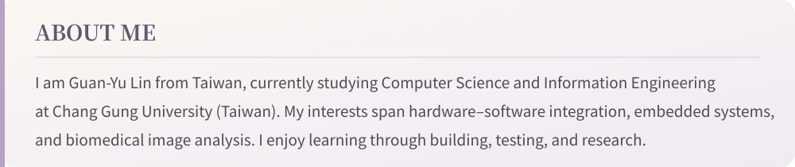

[繁體中文](../README.md)　/　**English**　/　[日本語](../ja/README.md)

COMPUTER SYSTEMS · BIOMEDICAL IMAGING · RESEARCH

[Source code](https://github.com/icguproject25-droid/electronic-nose-pineapple-ripeness-assessment)　·　[Project website](https://icguproject25-droid.github.io/pinenose_official_site/)　·　[Award announcement](https://ysyct.wda.gov.tw/news_detail.php?id=120)

[Research repository](https://github.com/Tiffanyxxx3238/freq-spatial-headneck-seg)　·　[medRxiv preprint](https://www.medrxiv.org/content/10.64898/2026.07.09.26357642v2)

[Browse all projects](https://github.com/lin-jessic/academic-research-portfolio)

